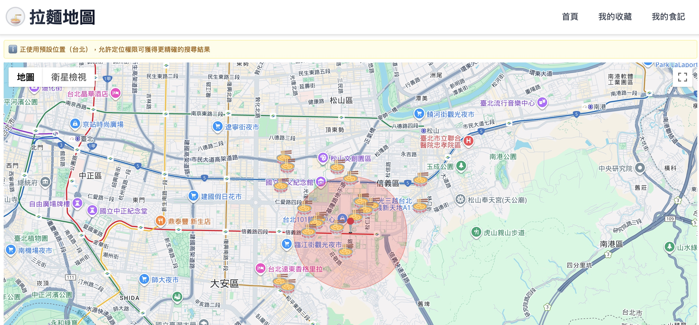
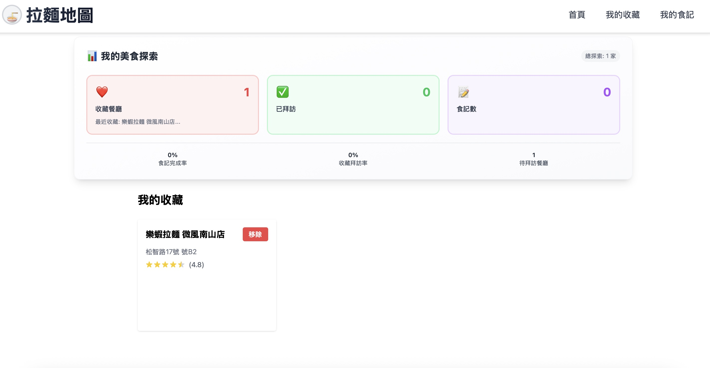
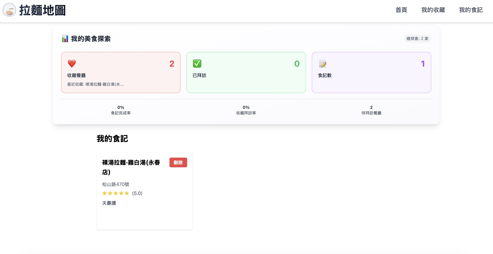

# Ramen Map





## 🚀 Project Overview

**Ramen Map** is a modern web application built with React that integrates Google Maps API to automatically mark ramen shops around your location. Users can quickly find ramen shops they want to try, add them to their personal favorites list, and write their own food reviews and ratings.

Key Features:
- 🗺️ Mark nearby ramen shop locations using Google Maps
- ⭐ Add and remove shops from personal favorites list with visit status tracking
- 📝 Write food reviews and ratings

---

## 🎯 Project Features

### 🗺️ Map Functionality
- Interactive map display using `@react-google-maps/api` package
- Automatic user location detection
- Mark nearby ramen shop locations with basic information
- Click markers to view detailed restaurant information

### 🏪 Favorites Management
- Browse detailed restaurant information (address, ratings, opening hours, etc.)
- Add restaurants to personal favorites list
- Remove restaurants from favorites list
- Restaurant data integration with Google Places API

### 📝 Review System
- Write restaurant reviews and feedback
- Five-star rating system
- View Google Maps reviews and ratings
- Personal review history management

---

## 🛠 Tech Stack

### Frontend

- **Framework**: React, React Router, Zustand
- **Third-party APIs**: Google Maps API, Google Places API
- **Styling/UI Framework**: Tailwind CSS
- **Build Tool**: Vite

---

## 🔧 Installation & Setup

### 1. Clone the Project

```bash
git clone https://github.com/Wuzi51/react-map-project
cd react-map-project
```

### 2. Install Dependencies

```bash
npm install
```

### 3. Environment Variables Setup

This project requires a Google Maps API Key to function properly. Please obtain an API Key from Google Cloud Console and create a .env file in the project root:

```bash
VITE_GOOGLE_MAPS_API_KEY=YOUR_API_KEY
```

### 4. Start the Project

```bash
npm run dev
```

Open your browser and navigate to:

- `http://localhost:3000`

---

## 📌 Future Plans

- Enhance search and filtering functionality
- Support more map interaction features to improve user experience