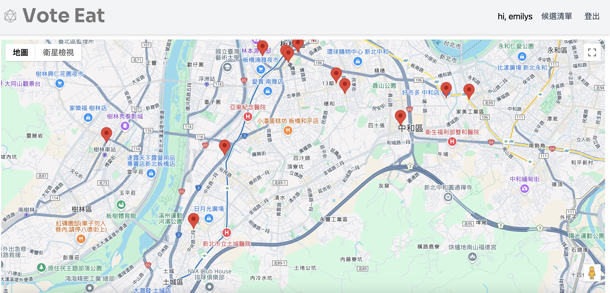
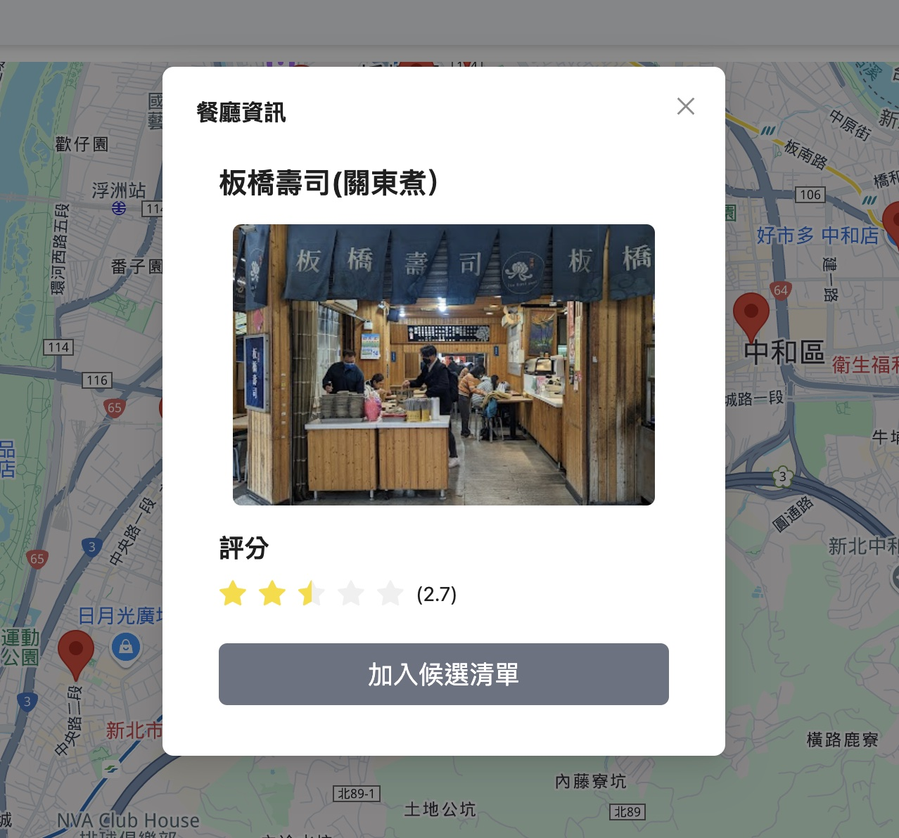
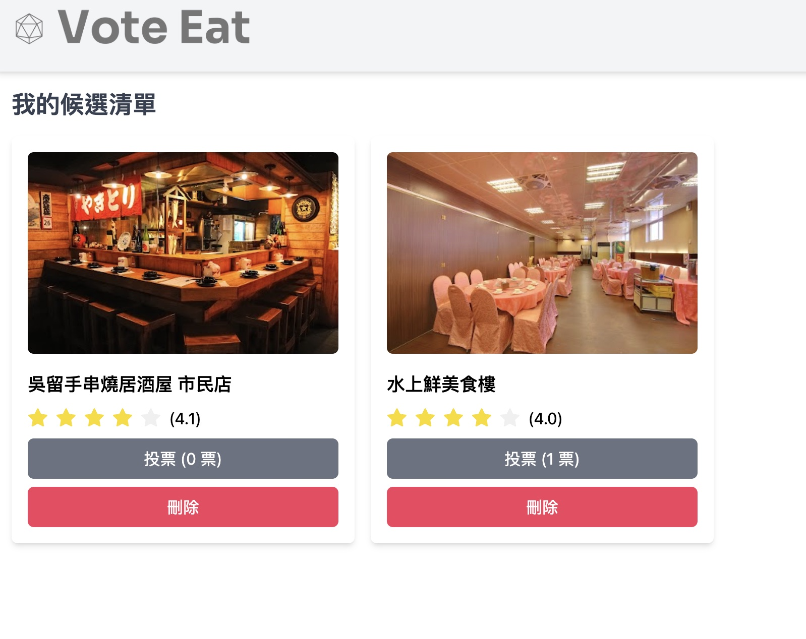

# Google Map 餐廳地點票選網站





## 🚀 專案簡介

**Google Map 餐廳地點票選網站** 是一個使用 React 開發web，結合 Google 地圖 API 提供餐廳選擇與票選功能，讓使用者能夠輕鬆瀏覽餐廳地點、投票選出心儀的餐廳。

主要特色：

- 使用 Google 地圖標註餐廳位置。
- 支援新增與移除餐廳至候選清單。
- 投票選出最喜愛的餐廳。
- 提供登入與登出功能。

---

## 🎯 專案功能

1. 地圖標記與搜尋：
   - 使用 `react-google-maps` 套件來顯示地圖並標註餐廳位置。

2. 餐廳候選清單：
   - 使用者可以新增及刪除候選清單。
3. 投票功能：
   - 用戶可以投票選擇最喜愛的餐廳。

4. 使用者登入與驗證：
   - 使用 JWT (JSON Web Token) 實現 Token-based 登入驗證。
   - 測試帳號：emilys，密碼：emilyspass。

---

## 🛠 技術棧

### 前端

- **框架**：React、React Router、Zustand
- **第三方 API**：Google Maps API、Google Place API
- **樣式管理/UI 框架**：Ant Design、Tailwind CSS
- **打包工具**：Vite

---

## 🔧 安裝與執行

### 1. 取得專案

```bash
git clone https://github.com/Wuzi51/react-map-project
cd react-map-project
```

### 2. 安裝套件

```bash
npm install
```

### 3. 啟動專案

```bash
npm run dev
```

在瀏覽器輸入以下網址即可看到專案：

- `http://localhost:3000`

---

## 📌 未來計劃

- 增強餐廳搜尋與篩選功能。
- 支援更多地圖交互功能，改善用戶體驗。
